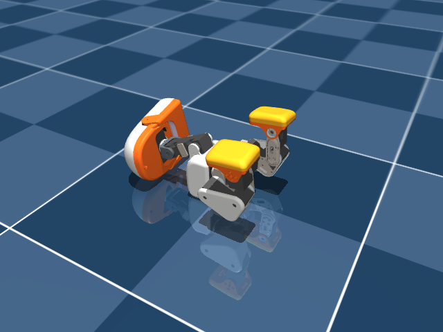

# PlayDead: design notes

Task id: `Mjlab-PlayDead-Flat-MicroDuck` (branch `play-dead` of `microduck_rl`, built on `polite-bow`).

The trick for "finger gun ... bang!": from a still stand the duck sits, lowers itself onto its back with its legs in the air, and turns its head to one side. Then it stays dead.



The files:

- `src/mjlab_microduck/tasks/microduck_play_dead_env_cfg.py`: the task. The poses and the timeline are in the CONSTANTS block at the top.
- `src/mjlab_microduck/tasks/play_dead_mdp.py`: the keyframed reference, the rewards, the costs and the termination.
- `tests/test_play_dead_cfg.py`: config invariants.
- `scripts/play_dead_eval.py`: a headless evaluation of the exported ONNX, with an optional MP4.

## How it is taught

It works the same way as PoliteBow: a hidden reference clock, a moving target, the clock given to the critic only, and no jackpots. The only new part is that the reference has several stages:

| Time (s) | Pose | Trunk pitch |
|---|---|---|
| 0.0 | stand (HOME) | 0° |
| 1.2 | sit (the SitStand keyframe) | 0° |
| 1.5 | still sitting: a beat | 0° |
| 2.9 | on its back, legs in the air | −90° |
| 3.5 | head turned to the side (head_yaw +1.4 rad) | −90° |
| 5.0 | still dead: the episode ends | −90° |

Each stage blends into the next with a smoothstep.

- **Main term:** trunk pitch follows the reference. This turns "fall over backwards" into "lie down at this pace".
- **Legs:** tracked with a generous std. Unlike the bow, the leg shapes (sit, then legs up) are the trick itself.
- **Head yaw:** its own term, because it is the punchline.
- **Neck:** tracked loosely. During the lie-down the policy may need to curl the neck to keep the heavy head (38% of the mass, camera inside) from swinging into the floor.
- **Safety costs:**
  - head speed while touching the floor (a slam is expensive, resting is free);
  - trunk |a_z|;
  - roll (belly up, not on a side);
  - drift;
  - the head touching the floor before the lie-down starts.
- **Termination:** lying on the back is the goal, so the usual `fell_over` is removed. Ending up on a side (roll > 60°) or tipping onto the face (pitch > +50°) ends the episode instead.
- **Symmetry loss is off:** the head turns to one side only.

## What was checked in sim before choosing the numbers

On the groundcontact model, with the robot dropped supine and the pose held by position control for 3 s:

- **HOME legs on the back:** stable, pitch −90°, roll 0°.
- **Legs up** (left hip_pitch −1.2, knee +0.5, mirrored on the right): stable and flat. Folding the hips the other way (+1.0) rolls the duck up onto its head.
- **Head_yaw ±1.4:** lays the head on its cheek. The pose stays flat (roll 0°) and stays still.
- **Sit keyframe:** reused from SitStand, where it was verified as a stable equilibrium.

What was **not** checked: the transition itself. Whether a controlled lowering from the sit is possible under BAM actuators is exactly what training finds out.

## The known risks

1. **Waypoint camping.** AGENTS.md warns that keyframed targets can make the policy camp at a waypoint. Here that could mean staying seated. The sit beat is only 0.3 s for that reason. If the eval shows the pitch lagging badly at 2 to 3 s, first remove the beat (set the third keyframe's `t` to 1.2).
2. **The head slam.** If `head impact speed` stays above about 0.5 m/s, raise `play_dead_head_impact_cost` or lengthen the lie-down (move the 2.9 s keyframe later).
3. **The hand-off.** The episode ends with the duck on its back. Whatever policy the runtime switches to next must be able to get up from there. StandUp is trained on face-up recovery. The walk/stand policy probably is not. Rehearse this in `scripts/infer_policy.py` before trying it on the robot.
4. **The beak.** The jaw has no servo in the 14-joint action space (in the sim it is fixed to the head), so no policy can open it. GroundPick, the policy behind the sock-pickup demo, is the same: it only brings the mouth to the floor and simulates a 10 to 40 g load in the beak during training. The jaw in that demo must therefore be driven by the runtime. Play dead should use the same mechanism: open the beak once the head has turned (about 3.5 s into the trick).

**Decided (29 Sep 2026):** after the trick, hand over to the StandUp policy. The head turns to the +1.4 rad side.

## How to judge a run

- **In the log** (`status.sh`):
  - every `*_cost` must read ≤ 0;
  - `Episode_Reward/play_dead_pitch` should climb;
  - `Episode_Termination/wrong_side_down` should fall towards 0;
  - mean episode length should reach 250 steps (5 s at 50 Hz).
- **With `fetch.sh`** (eval + video):
  - "ended on side/face" close to 0% in both the play and the training-DR evaluations;
  - "dead at the end" and "head turned" close to 100%;
  - head impact speed low;
  - pitch tracking that follows the table above.

  Then watch the MP4.
- **Budget:** 1,000 to 3,000 iterations at 4,096 envs. The bow took about the same.

## Deploying it

```bash
uv run publish --onnx exports/playdead-flat-N.onnx --repo <you>/microduck-play-dead \
    --kind episodic --duration-s 5.0 --description "Plays dead: sits, lies on its back, head to the side."
```

The "bang!" trigger (hearing the word) is the runtime's job, not the policy's.
